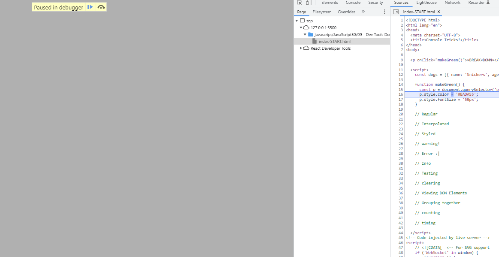

# What I learned

## Attribute Modification



- If you want to figure out how JavaScript changes an element on the page, right click on the element, -> **break on** -> **attribute modifications**
- This goes to the debugger in JavaScript once the js makes the element change somehow.

## Console logs

### Styling logs

Using the `%c` interpolator at the beginning of a log message will style it accordingly with CSS in the console.

```js
console.log("%c some text here", "font-size:2rem;color:blue");
```

### Log levels

- `console.warn(string)` : displays a message as a warning
- `console.error()`

```js
console.clear();
console.warn("A warning with console.warn()");
console.error("A message styled like an error with console.error()");
console.info("A message styled as information with console.info()");
```

### Viewing DOM elements

- `console.dir(element)` : console logs the element not just as HTML, but as a DOM element object, allowing you to see all its properties.

### Console groups

Console groups organize all log messages inside a group to be inside a collapsible toggle.

```js
console.groupCollapsed("dictionary stuff");
console.log(dogs[0].name);
console.log(dogs[1].name);
console.groupEnd("dictionary stuff");
```

Using console groups allows you neaten out console messages by grouping them together under a toggle. The way to do this is to position all related log messages inside a group, using this syntax:

```js
console.groupCollapsed("groupname");
// log messages here
console.groupEnd("groupname");
```

- `console.groupCollapsed(groupname)` : begins a group with the specified group name.
- `console.groupEnd(groupname)` : ends the specified group, closing the toggle.

### Timing

- `console.time(tag)` : starts timing with a specified tag
- `console.timeEnd(tag)` : ends timing with the specified tag, and displays elapsed time to the console.

```js
console.time("saying hello");
console.log("hello");
console.timeEnd("saying hello");
```

the way to use this is to start time for a specific activity using `console.time()`, and then end print out the elapsed time using `console.timeEnd()` when the activity is finished.

### Table
